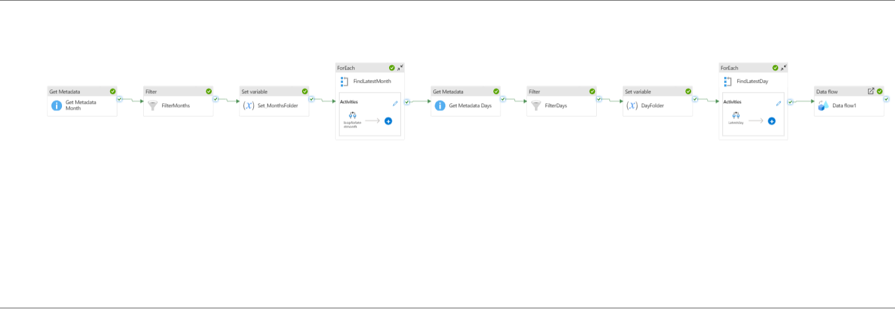
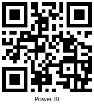
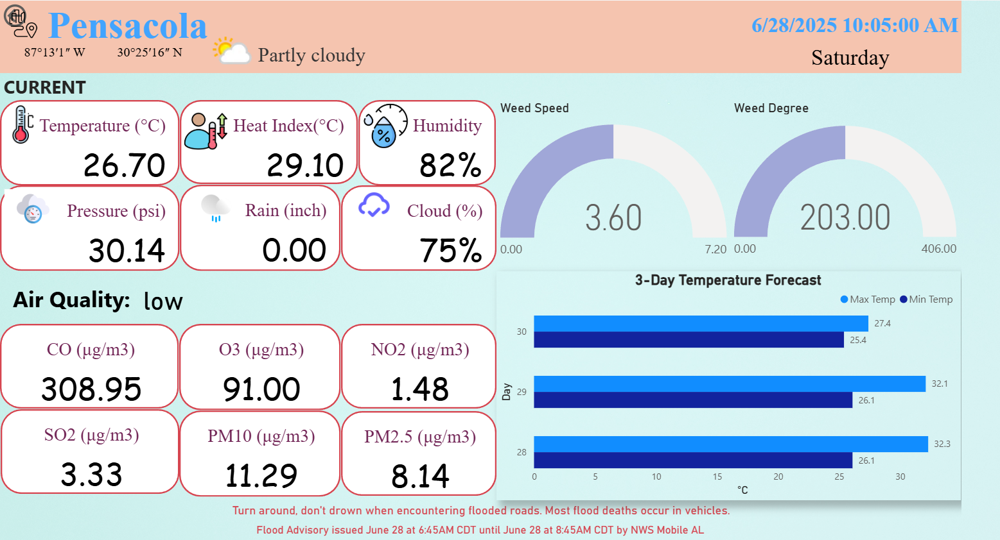

# Scheduled-Weather-Data-Streaming
This project implements a real-time data streaming pipeline that continuously fetches weather data from an external API and stream it into Azure for downstreaming processing and analytics. The pipeline is designed to be **scalable**, **fault-tolerant**, **cost-efficient** and suitable for real-time dashboard or big data processing. 

## Project Overview
The objective is to build an end-to-end pipeline that:
1. Fetch real-time weather data via API
2. Streams the data through Azure Event Hub
3. Stores the data in Azure Data Lake Storage Gen2
4. Transforms the data with Azure Data Factory
5. Serves the data via Synapse Serverless SQL Pool
6. Visualizes the output in a live Power BI dashboard

## Architecture
**Tech Stack:**

| Layer              | Tool/Service                          |
|-------------------|----------------------------------------|
| Data Source        | OpenWeatherMap API (or similar)        |
| Ingestion          | Azure Function App                     |
| Streaming Platform | Azure Event Hub                        |
| Storage            | Azure Data Lake Storage Gen2           |
| ETL/ELT            | Azure Data Factory (Mapping Data Flows)|
| Query Layer        | Azure Synapse Serverless SQL Pool      |
| Visualization      | Power BI                               |

## Data Flow
1. **Azure Function** is scheduled to trigger every 10 minutes to fetch weather data from the API .
2. The data is published to **Azure Event Hub** as JSON messages.
3. An eventhub trigger **Azure Function** writes the data into **Data Lake Storage Gen2** in hierarchical folders (e.g., by region and timestamp).
4. **Azure Data Factory** performs batch transformations to clean and standardize the schema.
5. **Synapse Serverless** reads the data via external tables and SQL views.
6. **Power BI** connects to the SQL endpoint and refreshes the dashboard.


## Project Structure

```plaintext
weather-streaming-project/
| File                 | Purpose                                                                 |
|----------------------|-------------------------------------------------------------------------|
| `function_app.py`     | Initializes the Azure Function App                                     |
| `timer_func.py`       | Timer-triggered function that fetches weather data from an API         |
| `eventhub_func.py`    | Event Hub-triggered function for further processing    |
| `local.settings.json` | Local development settings (API key, endpoints, secrets)               |
| `requirements.txt`    | Python package dependencies                                            |
| `host.json`           | Azure Function runtime configuration   
```

## Prerequisites

Azure Subscription

Azure CLI installed

Power BI Desktop installed

Event Hub, Data Lake Gen2, Synapse Analytics, Key Vault, Data Factory, and Function App configured

Python 3.10+ (for Azure Function)

Access to a weather API (https://www.weatherapi.com/)

##  Setup Instructions

**1. Clone the repository**
- git clone https://github.com/<your-username>/weather-streaming-project.git
- cd weather-streaming-project

**2. Deploy Azure Resources**

- You can use the Azure Portal or Bicep/ARM templates (if provided).

**3. Configure Azure Function**

- Add your weather API key to Azure Key Vault or as an environment variable.

- Deploy the function via VS Code or CLI.


**4. Create Event Hub and Link Function App**

- Create an Event Hub namespace and hub

- Set the Event Hub connection string in your function settings

**5. Connect Data Factory**

- Create linked services to Data Lake and Synapse

- Import pipelines from the repo

- Pipeline will be triggered every 8 hours. 
 

**6. Set Up Synapse Serverless SQL Pool**

- Create external tables pointing to your Gen2 data

- Validate SQL views

**7. Power BI Dashboard**

- Open the PBIX file

- Update the SQL Server connection string

- Publish to Power BI service (optional)

- To optimize costs, the dashboard refreshes every 8 hours at the following times:

  -- 12:00 AM

  -- 8:00 AM

  -- 4:00 PM

- Scan the QR code below to access the dashboard:



- The dashboard appears as shown below:

